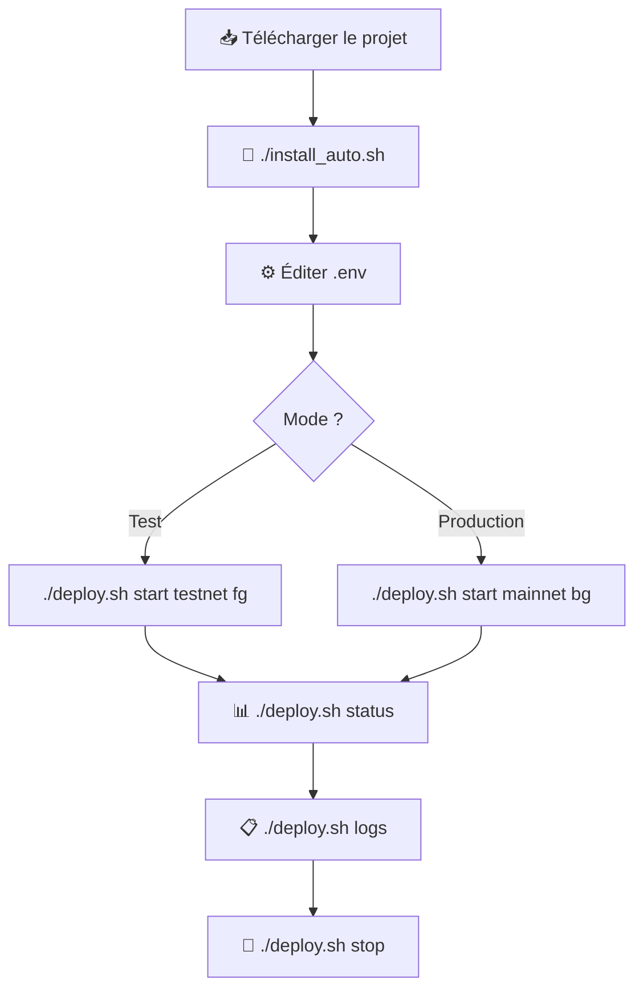

# 📦 FICHIERS D'INSTALLATION ET DE DÉPLOIEMENT

## 🎯 Objectif

Simplifier l'installation et le déploiement du bot en **UNE SEULE ACTION** pour l'utilisateur.

---

## 📂 Fichiers créés

### 1. Scripts d'installation automatique

| Fichier | Plateforme | Description |
|---------|------------|-------------|
| `install_auto.sh` | Linux/macOS | Installation complète en une commande |
| `install_auto.bat` | Windows | Installation complète en un clic |

**Fonctionnalités :**
- ✅ Vérification de Python 3.8+
- ✅ Création de l'environnement virtuel
- ✅ Installation des dépendances
- ✅ Création de la structure des dossiers
- ✅ Configuration du fichier .env
- ✅ Diagnostic automatique
- ✅ Une seule commande à exécuter !

### 2. Scripts de déploiement

| Fichier | Plateforme | Description |
|---------|------------|-------------|
| `deploy.sh` | Linux/macOS | Gestion complète du bot |
| `deploy.bat` | Windows | Gestion complète du bot |

**Fonctionnalités :**
- 🚀 Démarrage du bot (mainnet/testnet, foreground/background)
- 🛑 Arrêt du bot
- 🔄 Redémarrage du bot
- 📊 Affichage du statut
- 📋 Suivi des logs en temps réel
- 💡 Aide contextuelle

### 3. Documentation

| Fichier | Description |
|---------|-------------|
| `INSTALLATION.md` | Guide complet d'installation et d'utilisation |
| `sync_hyperliquid_orders.py` | Module de synchronisation corrigé (nouvelle logique) |

---

## 🚀 Utilisation rapide

### Linux / macOS

#### Installation (une seule commande)
```bash
chmod +x install_auto.sh && ./install_auto.sh
```

#### Déploiement
```bash
# Rendre exécutable
chmod +x deploy.sh

# Démarrer en testnet (temps réel)
./deploy.sh start testnet fg

# Démarrer en mainnet (arrière-plan)
./deploy.sh start mainnet bg

# Voir le statut
./deploy.sh status

# Arrêter
./deploy.sh stop
```

### Windows

#### Installation (un clic)
```
1. Clic droit sur install_auto.bat
2. "Exécuter en tant qu'administrateur"
```

#### Déploiement
```cmd
REM Démarrer en testnet (temps réel)
deploy.bat start testnet fg

REM Démarrer en mainnet (arrière-plan)
deploy.bat start mainnet bg

REM Voir le statut
deploy.bat status

REM Arrêter
deploy.bat stop
```

---

## 📋 Commandes disponibles

### deploy.sh / deploy.bat

```bash
# SYNTAXE
deploy.sh <commande> [mode] [execution]

# COMMANDES
start      # Démarrer le bot
stop       # Arrêter le bot
restart    # Redémarrer le bot
status     # Afficher le statut
logs       # Suivre les logs
help       # Afficher l'aide

# MODES
mainnet    # Production (défaut)
testnet    # Test

# EXÉCUTION
bg         # Background / Arrière-plan (défaut)
fg         # Foreground / Temps réel
```

### Exemples

```bash
# Démarrage simple (mainnet, background)
./deploy.sh start

# Testnet en temps réel (pour voir les logs)
./deploy.sh start testnet fg

# Mainnet en arrière-plan (production)
./deploy.sh start mainnet bg

# Voir le statut
./deploy.sh status

# Suivre les logs en direct
./deploy.sh logs

# Arrêter le bot
./deploy.sh stop

# Redémarrer en changeant de mode
./deploy.sh restart testnet fg
```

---

## 🔧 Modifications apportées

### sync_hyperliquid_orders.py

**🆕 NOUVELLE LOGIQUE :**
- Analyse par **Order ID + Time** (le plus récent)
- Construit l'historique complet des ordres
- Trie par timestamp (plus récent en premier)
- Prend le statut du plus récent
- **Résout le bug de la paire #85** (ordre marqué filled alors qu'il est open)

**Fonctionnement :**
```python
# Pour chaque Order ID :
1. Récupérer TOUS les enregistrements (open_orders + user_fills)
2. Trier par timestamp (DESC)
3. Prendre le statut le PLUS RÉCENT
4. Mettre à jour la BDD en conséquence
```

---

## 📁 Installation dans le projet

### 1. Placer les fichiers

```
trading-bot/
├── install_auto.sh         ← Racine du projet
├── install_auto.bat        ← Racine du projet
├── deploy.sh               ← Racine du projet
├── deploy.bat              ← Racine du projet
├── INSTALLATION.md         ← Racine du projet
│
└── command/
    └── sync_hyperliquid_orders.py  ← Remplacer l'existant
```

### 2. Rendre exécutables (Linux/Mac)

```bash
chmod +x install_auto.sh
chmod +x deploy.sh
```

### 3. Tester l'installation

```bash
# Linux/Mac
./install_auto.sh

# Windows
install_auto.bat
```

---

## ✅ Avantages

### Pour l'utilisateur

1. **Installation simple** : Une seule commande
2. **Pas de configuration manuelle** : Tout est automatique
3. **Déploiement flexible** : Mainnet/testnet, foreground/background
4. **Gestion facilitée** : Start, stop, status, logs
5. **Documentation complète** : INSTALLATION.md

### Pour le développeur

1. **Code propre** : Scripts modulaires et commentés
2. **Gestion d'erreurs** : Vérifications à chaque étape
3. **Logs détaillés** : Diagnostic facile
4. **Multi-plateforme** : Linux, macOS, Windows
5. **Maintenance simplifiée** : Tout est centralisé

---

## 🎯 Workflow complet



---

## 🔍 Diagnostic

Si problème :

```bash
# Diagnostic complet
python utils/diagnostic.py

# Logs du bot
cat log/trading.log           # Linux/Mac
type log\trading.log          # Windows

# Statut du déploiement
./deploy.sh status            # Linux/Mac
deploy.bat status             # Windows
```

---

## 📞 Support

### Documentation
- **Installation complète** : INSTALLATION.md
- **Configuration** : .env-template
- **Diagnostic** : utils/diagnostic.py

### Logs
- **Fichier** : log/trading.log
- **Temps réel** : ./deploy.sh logs

### Interface web
```
http://localhost:60000
```

---

## 🎉 Résultat

L'utilisateur peut maintenant :

✅ Installer le bot en **1 commande**
✅ Le démarrer en **1 commande**
✅ Choisir **mainnet/testnet**
✅ Choisir **foreground/background**
✅ Voir le **statut** facilement
✅ Suivre les **logs** en temps réel
✅ **Arrêter/Redémarrer** simplement

**Simple. Efficace. Professionnel.** 🚀
